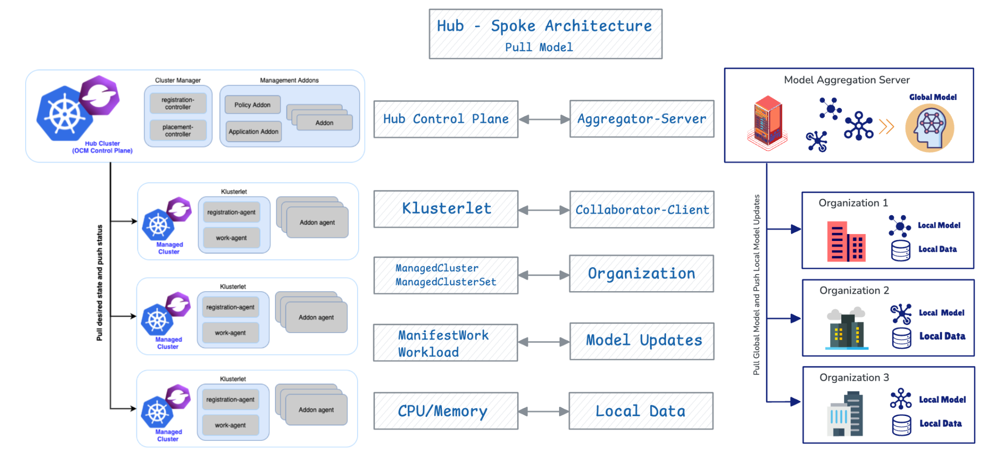

# Why Federated Learning Fits Open Cluster Management

Open Cluster Management (OCM) already implements the hub-and-spoke, pull-based control plane that federated learning (FL) relies on. By mapping FL concepts directly to OCM APIs, the federated learning controller can orchestrate distributed training with minimal new primitives while reusing OCM's mature multi-cluster governance, placement, and security capabilities.

## Shared Hub–Spoke Architecture

Both systems follow nearly identical topologies: a central coordinator that distributes work and aggregates results, and multiple spokes that execute tasks locally. In OCM the hub cluster manages registration, placement, and add-ons for every managed cluster; in FL the aggregator server coordinates model updates from collaborators. Because both depend on asynchronous pull semantics, Klusterlet agents simply retrieve FL workloads via ManifestWork, run local jobs, and push status back to the hub.

## Terminology and API Mapping

| OCM component | Federated Learning equivalent | Responsibility | Key API / CRD |
| --- | --- | --- | --- |
| Hub Control Plane | Aggregator / global server | Hosts the global model, schedules rounds, aggregates updates, exposes the listener endpoint | `FederatedLearning.spec.server`, hub `Job`, `Service`, `ModelStorageSpec` |
| Klusterlet | Collaborator client | Maintains the pull channel, retrieves manifests, reports status back to the hub | Klusterlet work agent, `ManifestWork` status |
| ManagedCluster | Collaborator runtime | Supplies the execution environment and local dataset for each FL client | `ManagedCluster`, cluster claims for dataset descriptors |
| ManifestWork | Model update package | Delivers templated client jobs that pull global models, train locally, and push deltas | `ManifestWork`, add-on templates, optional observability sidecar annotation |
| CPU/Memory | Local data & compute | Represents localized training resources that remain in place while contributing updates | Client `Job` resource requests, managed cluster resource quotas |

This top-down mapping shows how every FL role is fulfilled by an existing OCM API, so distributed training can reuse the native control plane instead of introducing parallel infrastructure.

## Federated Learning Workflow Inside OCM

1. **Containerize the training logic.** Package the aggregator and client programs into images so they can run as Kubernetes jobs managed by the hub and managed clusters.
2. **Apply the `FederatedLearning` CR.** Define the framework, images, storage, placements, and listener configuration in a CR and apply it to the hub cluster.
3. **Progress through the lifecycle.** The controller moves the CR through `Waiting` (resources deploying, clients being selected), `Running` (clients pulling work, training, and uploading updates), and `Completed` (all rounds finished, artifacts persisted) while surfacing status on the CR.

Throughout this lifecycle the controller reuses OCM’s pull-based delivery so managed clusters fetch workloads securely, publish results back to the hub, and benefit from existing observability and policy add-ons.
